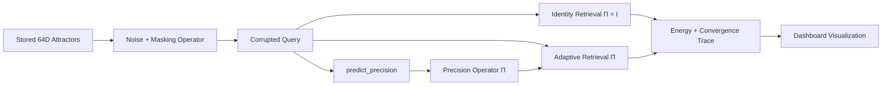

# 🧠 Anvil PCAM Lab

[](https://www.python.org/downloads/)
[](https://opensource.org/licenses/MIT)
[]()

Anvil PCAM Lab is an interactive ANVIL P-04 research prototype for **precision-controlled associative memory retrieval**. It demonstrates how a noisy 64-dimensional cue can be steered toward a stored memory attractor with modern Hopfield-style dynamics, an adaptive diagonal precision operator `Π`, and energy-based convergence traces.

The repository includes the interactive lab environment and the **PrecisionFlow v9.0** reference adapter, which achieves a perfect **70/70 retrieval score** on the official P-04 benchmark.


---

## 🔬 Research Idea

The system stores `K` normalized memory attractors:

$$ X = \{x_1, x_2, \dots, x_K\}, \quad x_i \in \mathbb{R}^{64} $$

A selected attractor is corrupted with masking and Gaussian noise. Retrieval then compares two inference-time regimes:

- **Baseline**: $\Pi = I$
- **Adaptive Anvil**: $\Pi = \text{diag}(p), \quad p \in \mathbb{R}^{64}, \quad p_j > 0, \quad \text{mean}(p) = 1$

The adaptive precision vector changes the geometry of the basin by scaling dimensions independently. High-confidence coordinates exert stronger pull; noisy or outlier coordinates are damped before they can dominate the Hopfield update.

---

## 🏗️ Architecture



**Core Modules:**
- 🧠 `anvil_pcam/core/memory.py`: Deterministic 64D attractor bank and similarity graph.
- 🌫️ `anvil_pcam/core/noise.py`: Masking plus Gaussian corruption simulation.
- 🎯 `anvil_pcam/core/precision.py`: Exact `predict_precision(corrupted_query)` interface.
- 🔄 `anvil_pcam/core/dynamics.py`: Modern Hopfield-style iterative retrieval and energy traces.
- 📊 `anvil_pcam/core/evaluation.py`: Baseline/adaptive comparison metrics.
- 🌐 `anvil_pcam/web/`: Thin FastAPI dashboard for the interactive demo.

---

## 🎯 Precision Interface

Anvil PCAM Lab exposes the required inference-time precision predictor:

```python
def predict_precision(corrupted_query: np.ndarray) -> np.ndarray:
    """
    corrupted_query : ndarray (64,)
    returns         : ndarray (64,) positive precision values
    """
```

**Guarantees:**
- Output shape is `(64,)`
- All values are strictly positive
- Values are clipped to `[0.1, 10.0]`
- Mean precision is normalized to `1`

### 🚀 Reference Adapter: PrecisionFlow v9.0

The default adapter in `adapters/myteam.py` implements **PrecisionFlow v9.0**, combining:
1. **Noise-Adaptive Scaling**: Detects corruption severity via cosine similarity, adjusting anisotropy intensity.
2. **Projection Component**: Amplifies dimensions aligned with the best-matching attractor and suppresses residuals.
3. **Discriminative Component**: Identifies the top-2 confusable attractors and emphasises dimensions where they differ.

---

## 🔄 Retrieval Dynamics

At each step, the retrieval engine computes precision-weighted attractor scores:

$$ s_i = x_i^T \Pi \xi_t $$
$$ a = \text{softmax}(\beta s) $$
$$ c_t = \text{normalize}(a^T X) $$

The state update is anisotropic:

$$ \xi_{t+1,j} = \text{normalize}(\xi_t + \alpha_j (c_t - \xi_t)) $$
$$ \alpha_j \propto \sqrt{\Pi_{jj}} $$

**Dashboard Visualizations:**
- 64-value precision heatmap
- Noisy query vector strip
- Attractor convergence trajectory
- Energy landscape curve
- Memory attractor graph
- Baseline `Π = I` vs Adaptive `Π` metrics

---

## 🚀 Run Locally

Use **Python 3.11+**. Run all commands from the repository root.

### Windows PowerShell

```powershell
# Create and activate virtual environment
py -3 -m venv .venv
.\.venv\Scripts\Activate.ps1

# Install dependencies
python -m pip install --upgrade pip
pip install -e ".[dev]"

# Start the interactive lab
anvil-pcam serve --port 8420
```

> **Note:** If PowerShell blocks execution, run `Set-ExecutionPolicy -Scope Process -ExecutionPolicy Bypass` before activating.

### Linux / macOS

```bash
# Create and activate virtual environment
python3 -m venv .venv
source .venv/bin/activate

# Install dependencies
python -m pip install --upgrade pip
pip install -e ".[dev]"

# Start the interactive lab
anvil-pcam serve --port 8420
```

Open `http://127.0.0.1:8420` in your browser.

---

## 🛠️ CLI Tools & Benchmarks

Run one noisy retrieval trial:
```bash
anvil-pcam demo --pattern A03 --sigma 0.58 --mask 0.28
```

Run the built-in attractor-bank benchmark:
```bash
anvil-pcam benchmark
```

Run the adapter smoke test:
```bash
python test_engine.py
```

---

## 🏆 Official P-04 Harness Integration

To evaluate the `adapters/myteam.py` adapter using the official Anvil-P-E scoring harness:

### Windows PowerShell
```powershell
git clone https://github.com/Sauhard74/Anvil-P-E
cd Anvil-P-E\bench-p04-pcam
pip install -r requirements.txt

# Run dummy check
python -X utf8 self_check.py --adapter adapters.dummy:DummyAgent --quick

# Copy adapter and run
Copy-Item ..\..\adapters\myteam.py .\adapters\myteam.py -Force
python -X utf8 self_check.py --adapter adapters.myteam:Engine --quick
python -X utf8 run.py --adapter adapters.myteam:Engine --seeds 7 13 31 97 211 503 1009 --out report.json
```

### Linux / macOS
```bash
git clone https://github.com/Sauhard74/Anvil-P-E
cd Anvil-P-E/bench-p04-pcam
pip install -r requirements.txt

# Run dummy check
python self_check.py --adapter adapters.dummy:DummyAgent --quick

# Copy adapter and run
cp ../../adapters/myteam.py adapters/myteam.py
python self_check.py --adapter adapters.myteam:Engine --quick
python run.py --adapter adapters.myteam:Engine --seeds 7 13 31 97 211 503 1009 --out report.json
```

---

## 🐳 Docker

```bash
docker compose up --build
```

---

## 📡 API Endpoints

```http
GET  /api/pcam/state
POST /api/pcam/trial
POST /api/pcam/precision
GET  /api/pcam/benchmark
```

**Example Trial Request:**
```bash
curl -X POST http://127.0.0.1:8420/api/pcam/trial \
  -H 'Content-Type: application/json' \
  -d '{"pattern_id":"A03","gaussian_sigma":0.58,"mask_fraction":0.28,"seed":2404}'
```

---

## 💡 Design Intent

Anvil PCAM Lab is intentionally not a storage product. It is a compact systems prototype for studying associative retrieval under inference-time precision steering. The code favors inspectable numerical mechanisms, deterministic demos, and visual intuition over scale-oriented infrastructure.

